# Assignment 5

## Part 1: PCA plot with weight = 1 and random cross validation
This is the result of plotting data from windsolarpower data from 2016 with weight = 1 and random cross validation.

### Scores and loadings:

The scores and loadings are presented below. The loading plot describes how much a variable is weighted when it comes to describing as much of the variance as possible. From the plot one can see that most of the variance lays in the RadSurface and RadTop variables. The weight = 1 resulted in the variables with the largest values dominating the analysis. This is confirmed by looking at the columns for these variables in the data set.

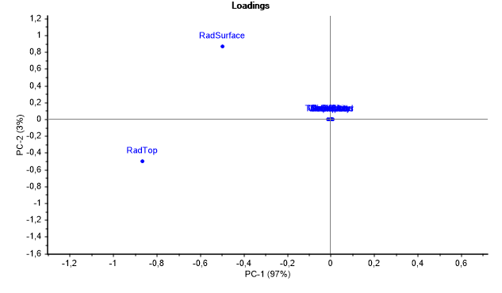

The scores plot shows the weighting of the different samples. The correlation between the data points in the scores plot and loadings plot yields that data points in the upper left corner in scores wil have high values in RadSurface. Likewise, the data in the lower left hand corner will have high values in the RaTop variable. 

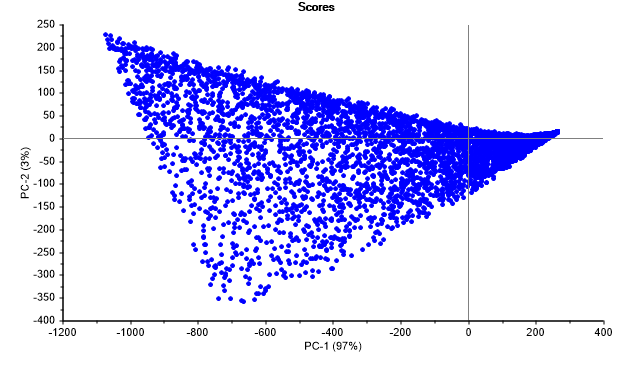

When adding grouping based on different months, a clear pattern is presented. The summer months with high radiation is represented with green on the left side, the large values in RadSurface and RadTop. Furthermore, the winter months are prepresented to the right.

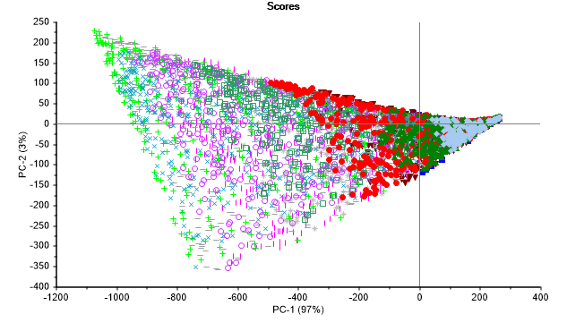

### Explained variance:
The plot below shows the explained variance. One can see that PC1 explaines 96% of the variance alone, and by including PC2 one can describe 99% of the variance, only by looking at two dimentions of the data. 

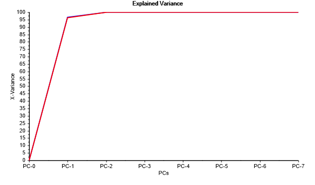

### Correlation loadings
The correlation loadings plot shows the correlation between the score vectors and individual variables. It shows how much of the total variance of a variable is explained by the PCs. If a variable lies on the outer circle in the plot, 100% of its variance is explained by the PC. If it lies in the inner circle, 50% is explained. 

The plot shows that RadSurface, RadTop, IrrDiffuse and IrrDirect is nearly 100% explained by the PCs. The rest of the variables' variance is explained by under 50%.

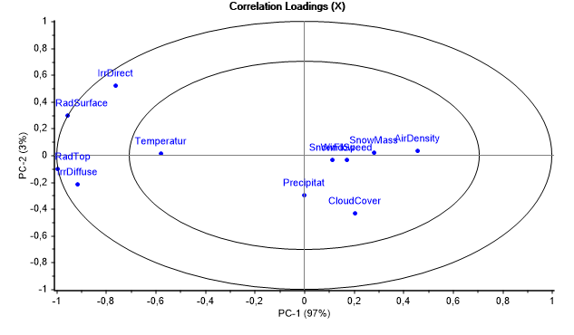

## Part 2: PCA plot with weight = 1/std and random cross validation

We will now calculate PCA with weighting = 1/std.dev for each variable.

### Scores and loadings:

Using weighting = 1/std.dev results in a PCA plot that takes all the variables in to account. The difference between the results of the weights (w) is that w = 1 will be constant for all variables no matter their value. This resulted in the variables with the highest values being most prominent. Meanwhile with w = 1/std.dev the resultes will be scaled appropriately. 

The loadings plot present the variances of the different variables which is all taken into account. One can see both positive and negative correclations between the different variabels. One can see how IrrDirect, RadSurface, RadTop and IrrDiffuse are positively correlated. The temperature and mass are negatively correlated.

If we apply grouping on the different months on the score plot, the connections with the loadings is clearly prominent. All the samples on the leftmost side are from the summer months, which is natural as there is more sun in the summer. The samples in the upper right are from winter, as the months has the most snow and lowest temperature.

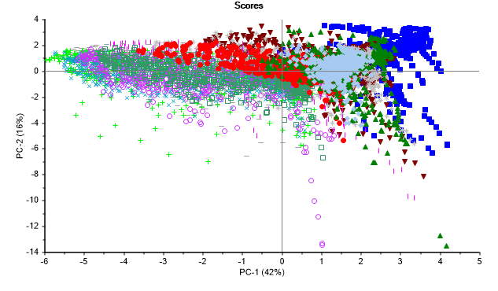

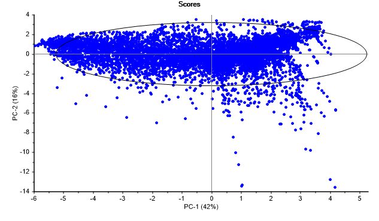

### Explained variance:

With weights = 1/std.dev, PC1 and PC2 explaines less of the total variance of the data set. Thsi is natural, as we now are weighting all the different variances the same way and thus the variance are disturbed into many more dimensions than the previous part.

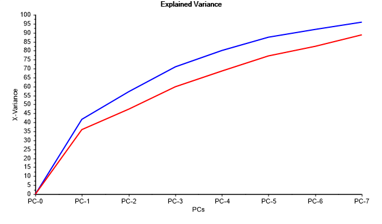
### Correlation loadings:
By taking a look at the correlation loadings in this case it is clear that this PCA model explains greater deal of the variance of the different variables than with weight = 1 as in part one. This can be derived from the data points being located further out in the elipses. The crucial data is however not covered by only PC1 and PC2, by observing that there still exists data points inside the inner elipse. 
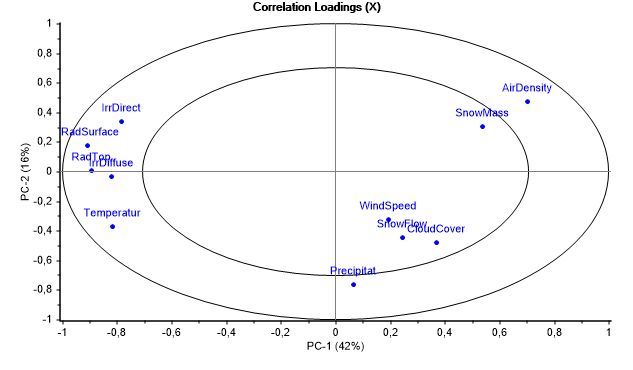

### Optimal number of PCAs:
PC1 and PC2 in this model only explaines 56% of the total variance. To achieve a greater explained variance one could include more PCs. 3 to 4 would probobly be appropriate. 

### Line Plot of Scores:
The plot below shows a zoomed line plot of the daily variations. Each day consists of 24 samples. 

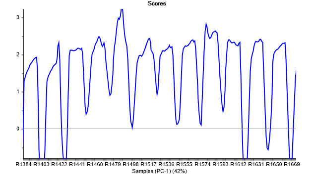

## Part 3: Systematic validation
When using systematic validation one achieves the same result as in the previous part, only the validation in the explained variamce is lower. This is due to the fact that the model is no longer validated randomly and thus performs worse on the validation. the explained vatianve can be seen bwlow. 
.png)

When changing to validation on day and night category pairs the data validation gets even worse. 

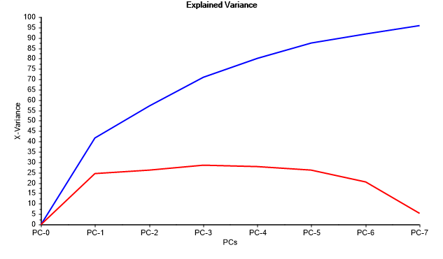

## Part 4: Hotelling's T^2 and F-residuals plot
According to the plot below, there may be many discrepancies. An outsider will often lie on the large square in the middle of the plot. Thus, the points in the right corner of the plot are likely to be different. Upon closer inspection, this point may be an outlier caused by an unusually high amount of snow. This sample is from the month of April where the snow flow is usually 0. The same applies to the sample that lies to the right. This sample had much greater snow current than usual. The two samples at the top left had a higher wind speed than usual during that period, and are thus marked as an outlier.

After inspecting several of these possible discrepancies, it appears that all come from a variable with a higher or lower value than usual during that period.
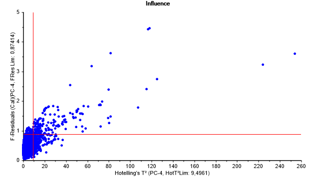

## Part 5: Projection of 2017 onto 2016 data set

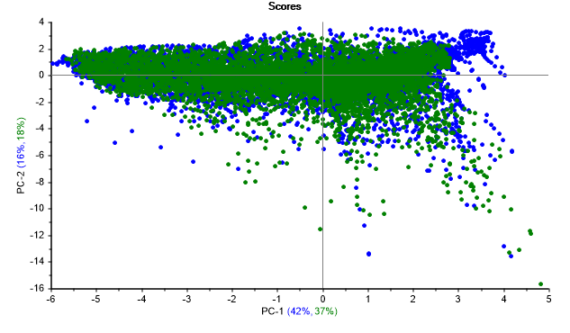

## Part 6: Cross validate all data over a year

