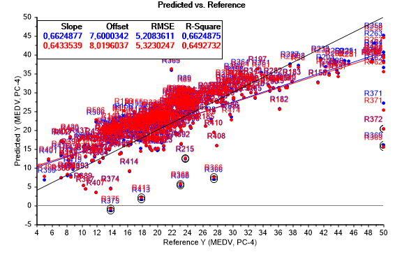
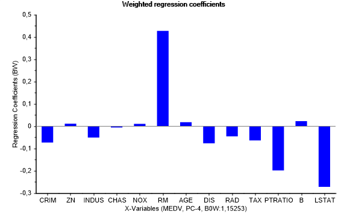

# Assignment 7: PCR and PLS on housing data

## PCR model

### Scores
Same as PCA model, Explained variance: validation follows the variation, take out 5% of the model will not change. 

### Loadings
Modelling 38% of the variance of X and 9% og Y. We can see this from the second percentage on the respective axis. Want to model a response variable. Some of the variables tell the same stories, as we can see in the right area of the plot. 
 
### Influence

### Predicted vs. reference
Model the response variable. Have some outliers. scale from 5 to 50 000 $. Reaching a maximum in ref. RMSE error. Really bad at predicting at x = 50.

### Weighted regression coefficients
RM has large positive link and LSTAT har large negative stat. Since all predictors are brought back to the same scale, the coefficients show the relative importance of the X-variables in the model. A positive coefficient shows a positive link with the response, and a negative coefficient shows a negative link. Predictors with a small coefficient are negligible. 

### Residuals
One can observe that the appropriate number of PCs needed to describe the data set is 4. By this point, the essential part of the porportion of variance accounted for by the PCs. 

## PCR model no outliers
We calculated the model without some outliers, and by looking at scores nd loadings, the performance of the system is the same. This yields a less comlicated system describing the same data set, as we want. 

The error is 4 comparing to 5.3 in PCR with outliers. 

One can observe that we have accounted for aproxametly the same proportion of variation of the variance by only 3 PCs. 

### Weighted regression coeffisients

Regression coefficienfs after 4 PCs. Which variables comes out as important. 

## PLS

The number of PCs need in PCR was 4 and the number of factors needed in PLS is 2. The difference between PCR and PLS lies in the algorithm. PLS uses the information lying in both X and Y to fit the model, switching between X and Y iteratively to find the relevant PCs. So PLS often needs fewer PCs to reach the optimal solution because the focus is on the prediction of the Y-variables (not on achieving the best projection of X as in PCA).

### Predicted vs ref

Has outliers. 

### Weighted reg coef

Model is very similar to PCR. After 4 PCs same error as PLS after 2. PLS managed to rotate scores and loading space to be quicker to achieve the goal. The error is ca 5 which is the same as PCR. 

MLR solution no variance left in X, when all factors is accounted for.

Only need 2 factors (same as PCs) compared to 4 in PCR.

The regression coefficients are similar for PCR and PLS. This means that even though we use a different model, we obtain the same result using less PCs. 

## Prediction

estimated valkue of houses with unceartinty. 

error is mostly the same

The large difference in regression coefficients between PCR/PLS and MLR is caused by the large correlation between sevral x-variables. In other words we have collinearity among the x-variables. This makes regression coefficients unreliable when using MLR.

